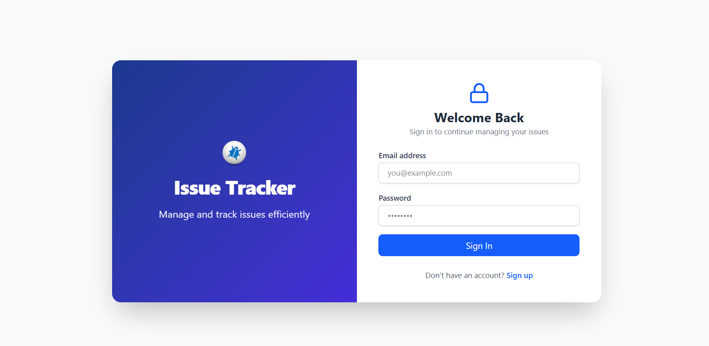

# 🐞 Issue Tracker

A full-stack MERN (MongoDB, Express.js, React, Node.js) application for tracking and managing issues/bugs with user authentication and authorization.

## 📋 Table of Contents

- [Features](#features)
- [Demo Screenshots](#demo-screenshots)
- [Live Demo](#live-demo)
- [Tech Stack](#tech-stack)
- [Prerequisites](#prerequisites)
- [Installation](#installation)
- [Configuration](#configuration)
- [Usage](#usage)
- [Deployment](#deployment)
- [API Endpoints](#api-endpoints)
- [Project Structure](#project-structure)
- [Contributing](#contributing)
- [License](#license)

## ✨ Features

### Authentication & Authorization

- User registration and login with JWT tokens
- Protected routes for authenticated users
- Role-based access control (Admin/User)
- Automatic token validation and refresh

### Issue Management

- Create, read, update, and delete issues
- Issue prioritization (High, Medium, Low)
- Issue status tracking (Open, In Progress, Closed)
- Detailed issue descriptions and timestamps
- User ownership and permission-based editing

### User Interface

- Responsive design with Tailwind CSS
- Clean and intuitive user interface
- Real-time feedback and loading states
- Search and filter capabilities
- Mobile-friendly design

## 📸 Demo Screenshots

### Authentication Pages

#### Login Page


_User login with email and password validation_

#### Register Page


_New user registration with form validation_

### Issue Management

#### Issue List


_Main dashboard showing all issues with search and filter options_

#### Issue Details


_Detailed view of individual issue_

#### Create Issue Form


_Form to create new issues_

#### Edit Issue Form


_Form to update existing issues_

> **Note:** Screenshots are located in the `screenshots/` folder.

## 🌐 Live Demo

The application is successfully deployed and accessible online:

- **Frontend (Vercel):** [https://issue-tracker-ivory-omega.vercel.app](https://issue-tracker-ivory-omega.vercel.app)
- **Backend API (Railway):** [https://issue-tracker-production-87cf.up.railway.app](https://issue-tracker-production-87cf.up.railway.app)

### Deployment Status

- ✅ Frontend: Successfully deployed on **Vercel**
- ✅ Backend: Successfully deployed on **Railway**
- ✅ Database: **MongoDB Atlas** (Cloud)

## 🛠️ Tech Stack

### Frontend

- **React 19.1.0** - User interface library
- **React Router DOM 7.7.0** - Client-side routing
- **Axios 1.11.0** - HTTP client for API requests
- **Tailwind CSS 4.1.11** - Utility-first CSS framework
- **Lucide React 0.525.0** - Beautiful icon library
- **Vite** - Fast build tool and development server

### Backend

- **Node.js** - JavaScript runtime
- **Express.js 5.1.0** - Web application framework
- **MongoDB** - NoSQL database
- **Mongoose 8.16.4** - MongoDB object modeling
- **JWT (jsonwebtoken 9.0.2)** - Authentication tokens
- **bcryptjs 3.0.2** - Password hashing
- **CORS 2.8.5** - Cross-origin resource sharing

## 📋 Prerequisites

Before running this application, make sure you have the following installed:

- **Node.js** (v16 or higher) - [Download here](https://nodejs.org/)
- **MongoDB** - [Download here](https://www.mongodb.com/try/download/community) or use [MongoDB Atlas](https://www.mongodb.com/atlas)
- **Git** - [Download here](https://git-scm.com/downloads)
- **npm** or **yarn** package manager

## 🚀 Installation

### 1. Clone the Repository

```bash
git clone https://github.com/SajiniWeerasinghe/Issue-Tracker.git
cd Issue-Tracker
```

### 2. Install Backend Dependencies

```bash
cd server
npm install
```

### 3. Install Frontend Dependencies

```bash
cd ../frontend
npm install
```

## ⚙️ Configuration

### Backend Configuration

1. Create a `.env` file in the `server` directory:

```bash
cd server
touch .env
```

2. Add the following environment variables to the `.env` file:

```env
# Database Configuration
MONGODB_URI=mongodb://localhost:27017/issue-tracker
# For MongoDB Atlas: mongodb+srv://<username>:<password>@<cluster>.mongodb.net/issue-tracker
# JWT Configuration
JWT_SECRET=your-super-secret-jwt-key-here
JWT_EXPIRES_IN=7d

# Server Configuration
PORT=5000
NODE_ENV=development

# CORS Configuration
CLIENT_URL=http://localhost:5173
```

### Frontend Configuration

The frontend is configured to connect to the backend at `http://localhost:5000`. If you need to change this:

1. Update the API base URL in the frontend authentication context and components
2. The default Vite development server runs on `http://localhost:5173`

## 🎯 Usage

### Development Mode

1. **Start the Backend Server:**

```bash
cd server
npm run dev
```

The server will start on `http://localhost:5000` with nodemon for auto-restart.

2. **Start the Frontend Development Server:**

```bash
cd frontend
npm run dev
```

The frontend will start on `http://localhost:5173`.

3. **Access the Application:**

Open your browser and navigate to `http://localhost:5173`

### First Time Setup

1. When you first access the application, you'll be redirected to the login page
2. Click "Create an account" to register a new user
3. After registration/login, you'll be redirected to the issue list
4. Click "Create Issue" to add first issue

## � Deployment

This application has been successfully deployed using modern cloud platforms:

### Frontend Deployment (Vercel)

- **Platform:** [Vercel](https://vercel.com/)
- **Build Command:** `npm run build`
- **Output Directory:** `dist`
- **Environment Variables:** None required (API URL configured)

### Backend Deployment (Railway)

- **Platform:** [Railway](https://railway.app/)
- **Start Command:** `npm start`
- **Environment Variables:**
  - `MONGO_URI` - MongoDB Atlas connection string
  - `JWT_SECRET` - JWT signing secret
  - `PORT` - Auto-assigned by Railway
  - `NODE_ENV=production`

### Database

- **MongoDB Atlas** - Cloud-hosted MongoDB database
- Configured for production with proper connection pooling
- Secured with IP whitelisting and authentication

### Deployment Features

- ✅ Automatic deployments on push to main branch
- ✅ HTTPS enabled for both frontend and backend
- ✅ Environment-specific configurations
- ✅ CORS properly configured for cross-origin requests
- ✅ Production-optimized builds

## �🔗 API Endpoints

### Authentication Routes (`/api/auth`)

| Method | Endpoint    | Description         | Auth Required |
| ------ | ----------- | ------------------- | ------------- |
| POST   | `/register` | Register a new user | No            |
| POST   | `/login`    | Login user          | No            |
| GET    | `/profile`  | Get user profile    | Yes           |

### Issue Routes (`/api/issues`)

| Method | Endpoint | Description      | Auth Required     |
| ------ | -------- | ---------------- | ----------------- |
| GET    | `/`      | Get all issues   | No                |
| GET    | `/:id`   | Get single issue | No                |
| POST   | `/`      | Create new issue | Yes               |
| PUT    | `/:id`   | Update issue     | Yes               |
| DELETE | `/:id`   | Delete issue     | Yes (Owner/Admin) |

## 🧪 API Testing

All API endpoints have been tested using **Postman** for proper functionality, authentication, and error handling.

**Base URL:** `http://localhost:5000/api`

### Sample Requests

**Authentication:**

```bash
POST /auth/register
POST /auth/login
GET /auth/profile (Protected)
```

**Issues:**

```bash
GET /issues
POST /issues (Protected)
PUT /issues/:id (Protected)
DELETE /issues/:id (Owner/Admin only)
```

## 📁 Project Structure

```
Issue-Tracker/
├── frontend/                 # React frontend application
│   ├── public/              # Static assets
│   ├── src/
│   │   ├── components/      # React components
│   │   │   ├── IssueList.jsx
│   │   │   ├── IssueDetails.jsx
│   │   │   ├── IssueCreate.jsx
│   │   │   ├── IssueEdit.jsx
│   │   │   ├── Login.jsx
│   │   │   ├── Register.jsx
│   │   │   ├── Navbar.jsx
│   │   │   └── ProtectedRoute.jsx
│   │   ├── context/         # React Context providers
│   │   │   └── AuthContext.jsx
│   │   ├── assets/          # Images and icons
│   │   ├── App.jsx          # Main App component
│   │   ├── main.jsx         # Entry point
│   │   └── index.css        # Global styles
│   ├── package.json         # Frontend dependencies
│   └── vite.config.js       # Vite configuration
├── server/                  # Express backend application
│   ├── models/              # Mongoose models
│   │   ├── Issue.js
│   │   └── User.js
│   ├── routes/              # API routes
│   │   ├── issues.js
│   │   └── auth.js
│   ├── middleware/          # Custom middleware
│   │   └── auth.js
│   ├── server.js            # Main server file
│   └── package.json         # Backend dependencies
└── README.md               # Project documentation
```

## 🔐 Authentication Flow

1. **Registration/Login:** Users register or login with email and password
2. **JWT Token:** Server returns a JWT token valid for 7 days
3. **Token Storage:** Frontend stores token in localStorage
4. **Auto-Login:** Token is automatically included in API requests
5. **Route Protection:** Protected routes redirect to login if no valid token
6. **Auto-Logout:** Invalid/expired tokens trigger automatic logout

## 📱 User Permissions

- **Any User:** View issues, register, login
- **Authenticated Users:** Create issues, edit any issue
- **Issue Owner/Admin:** Delete issues (only their own or if admin)

## 🚦 Available Scripts

### Frontend

- `npm run dev` - Start development server
- `npm run build` - Build for production
- `npm run preview` - Preview production build
- `npm run lint` - Run ESLint

### Backend

- `npm start` - Start production server
- `npm run dev` - Start development server with nodemon

## 👨‍💻 Author

**Sajini Weerasinghe**

- GitHub: [@SajiniWeerasinghe](https://github.com/SajiniWeerasinghe)
